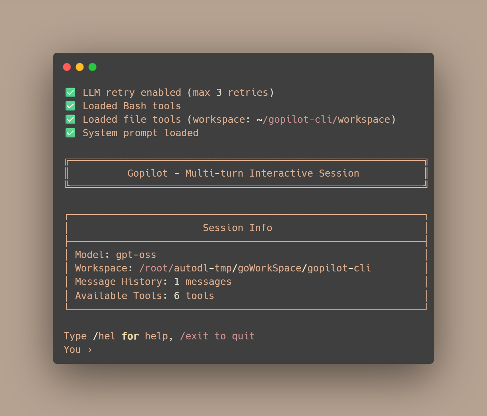

# Gopilot-CLI

[](https://golang.org/dl/)
[](LICENSE)

<a title="中文" href="./README_zh.md">
  
</a>
<a title="English" href="./README.md">
  
</a>

<div align="center">
  
</div>

Gopilot-CLI 是一个基于 Go 实现的终端多轮对话式 AI 编码代理。  
它通过 OpenAI 兼容的 API 工作，可以在你的工作目录中执行 Shell 命令、读写文件，并在会话过长时自动进行摘要。

## 环境要求

- Go `1.21+`
- 一个 OpenAI 兼容的对话 API（如 OpenAI、本地网关或开源服务）
- 该服务对应的有效 API Key

## 快速开始

### 安装

```bash
# 克隆并构建
git clone <仓库地址>
cd gopilot-cli
go build -o gopilot ./cmd/gopilot
```

### 配置

Gopilot-CLI 的主要配置来自 `configs/config.yaml`。  
你可以在该文件中设置 API 密钥，也可以通过环境变量提供：

```bash
export OPENAI_API_KEY="your-api-key-here"
```

在 `configs/config.yaml` 中：

```yaml
llm:
  api_key: "sk-xxx"                     # 若使用环境变量，可留空
  api_base: "https://api.openai.com/v1" # 或你的自定义兼容端点
  model: "gpt-4.1"                      # 或任意兼容模型

agent:
  workspace_dir: "./workspace"          # 默认工作空间目录
  max_steps: 50
  token_limit: 80000                    # 触发历史消息摘要的阈值
```

当同时配置 `llm.api_key` 和环境变量 `OPENAI_API_KEY` 时，  
代码会优先使用配置文件中的 `llm.api_key`。

### 使用

```bash
# 使用当前目录作为工作空间
./gopilot

# 或指定工作目录
./gopilot -w /path/to/workspace
```

推荐使用方式：

- 在某个项目目录中运行 `gopilot`
- 用自然语言描述你要完成的任务（例如“添加一个 REST 接口”“修复测试用例”）
- 让 Gopilot 通过工具自动编辑文件并执行相关命令

## 功能特性

- 🔄 **多轮对话** 保持上下文持续对话
- 🛠️ **工具调用** 执行命令和文件操作
- 📝 **自动摘要** token 超限时自动总结
- 🎨 **交互式终端** 支持命令补全
- 🔁 **重试机制** 指数退避重试

## 工具

### Bash 工具
- `Bash` - 执行 Shell 命令
- `BashOutput` - 监控后台进程
- `BashKill` - 终止进程

### 文件工具
- `Read` - 读取工作空间内文件
- `Write` - 创建/覆盖文件
- `Edit` - 修改文件内容

## 命令

| 命令 | 描述 |
|------|------|
| `/help` | 显示可用命令 |
| `/clear` | 清除会话历史 |
| `/history` | 显示消息数量 |
| `/stats` | 显示会话统计 |
| `/exit` | 退出程序 |

也支持：`exit`、`quit` 或 `q`

## 开发

```bash
# 构建二进制文件
go build -o gopilot ./cmd/gopilot

# 运行测试
go test ./tests/...

# 格式化代码
go fmt ./...
```

## 依赖

- [`openai/openai-go/v3`](https://github.com/openai/openai-go) - OpenAI API SDK
- [`c-bata/go-prompt`](https://github.com/c-bata/go-prompt) - 交互式终端
- [`pkoukk/tiktoken-go`](https://github.com/pkoukk/tiktoken-go) - Token 计数
- [`stretchr/testify`](https://github.com/stretchr/testify) - 测试断言
