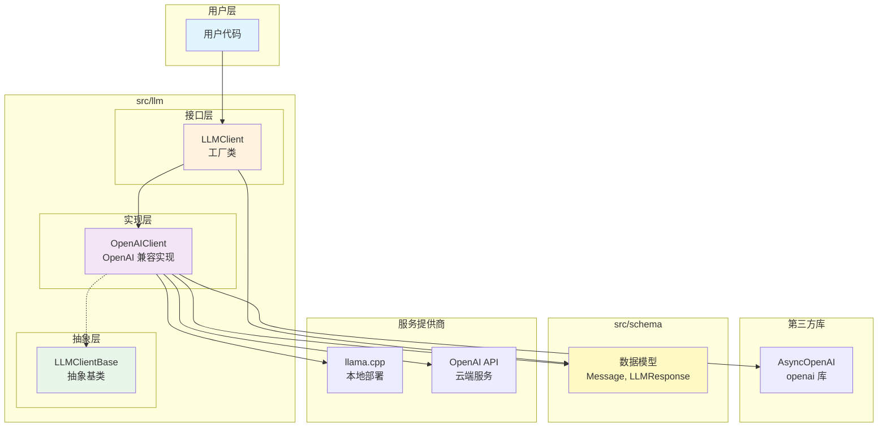
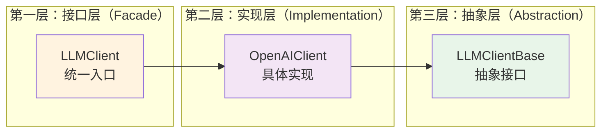
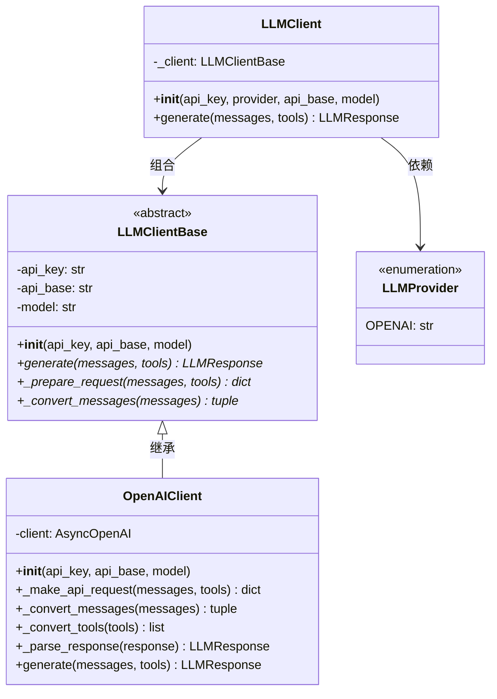
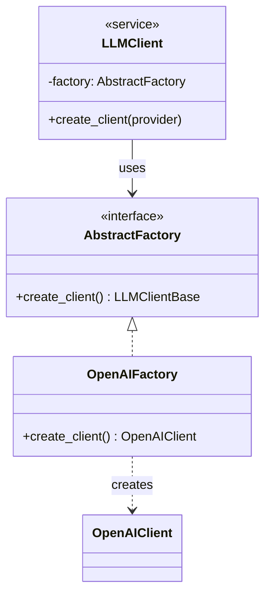
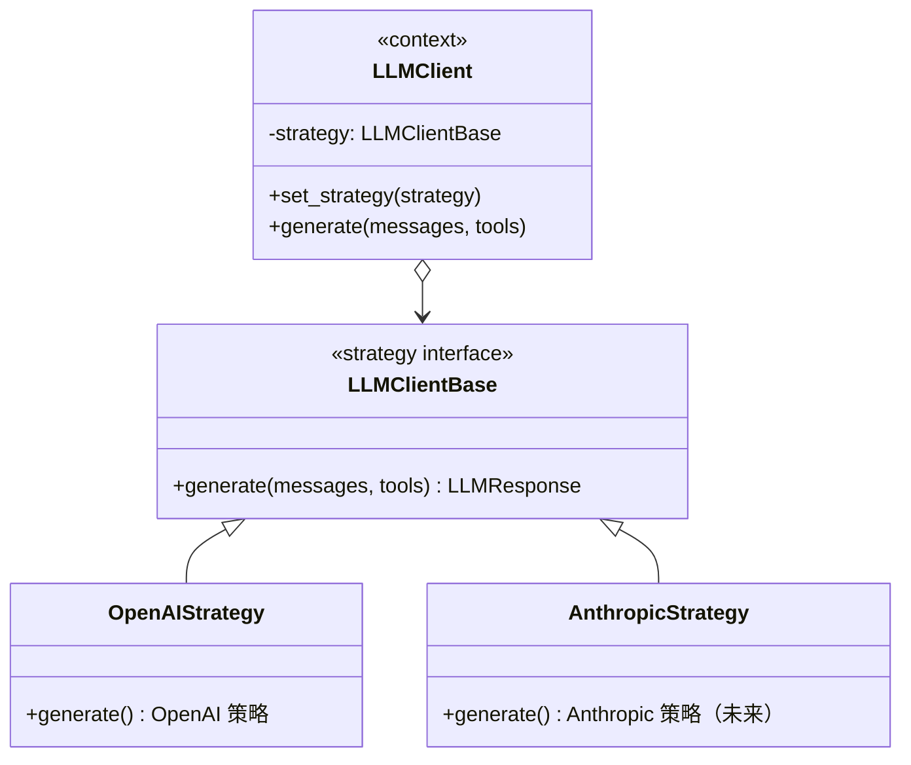
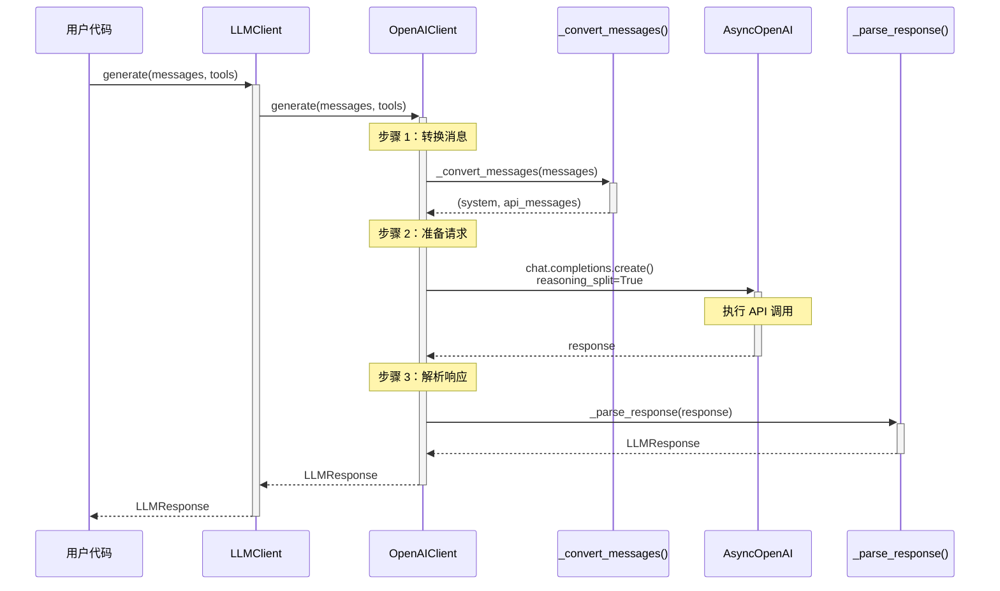
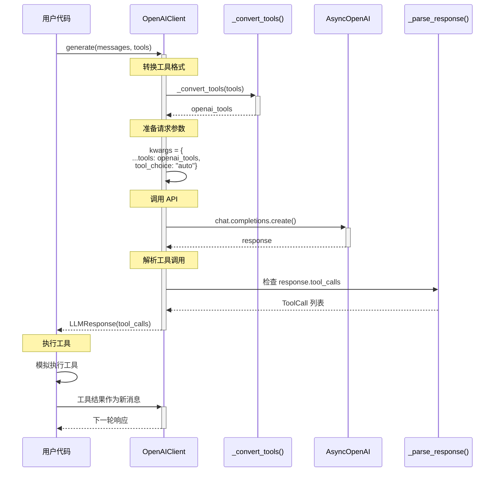
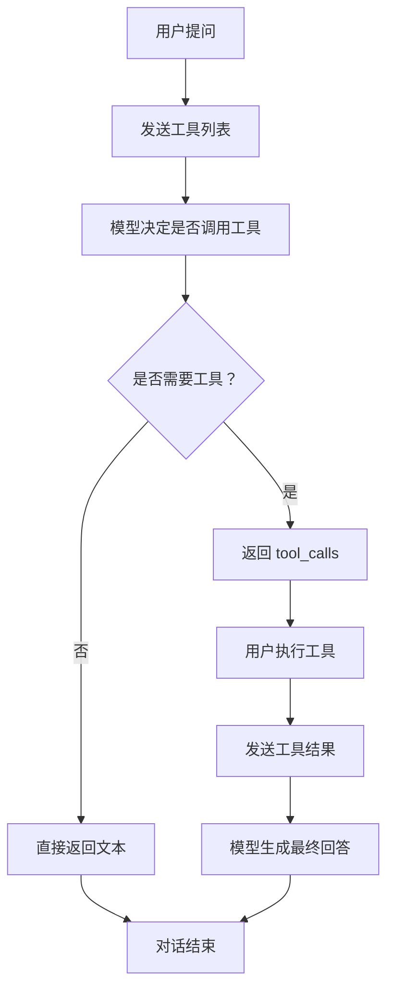
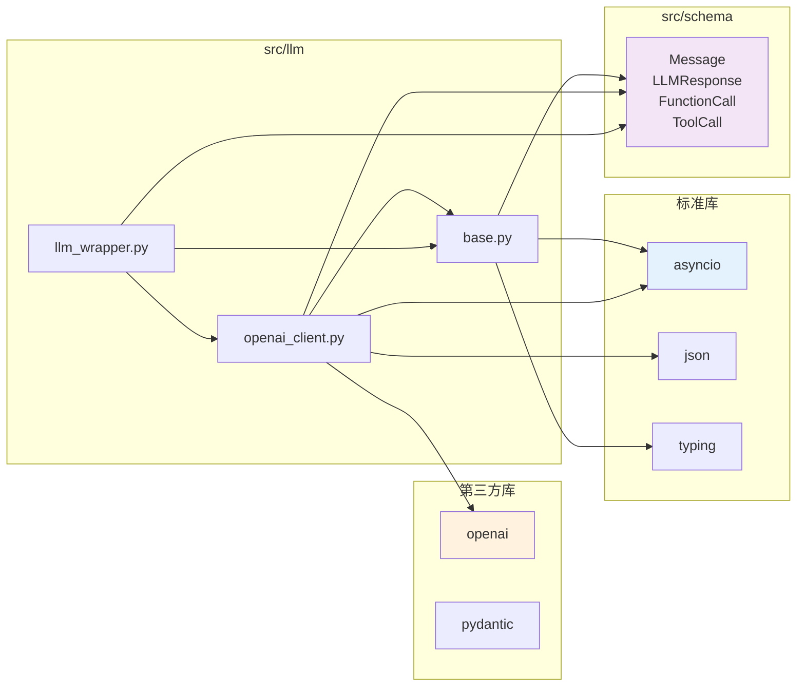

# 架构设计文档

本文档详细介绍 LLM 模块的架构设计、设计模式、核心组件和实现细节。

## 📋 目录

- [模块架构](#模块架构)
- [类层次结构](#类层次结构)
- [核心组件](#核心组件)
- [设计模式](#设计模式)
- [执行流程](#执行流程)
- [消息适配机制](#消息适配机制)
- [思考内容机制](#思考内容机制)
- [工具调用机制](#工具调用机制)
- [依赖关系](#依赖关系)
- [设计原则](#设计原则)
- [扩展性](#扩展性)

---

## 模块架构

### 整体架构图



### 三层架构设计



### 模块结构

```
src/llm/
│
├── __init__.py                      # 模块导出
│   ├── LLMClientBase               # 抽象基类
│   ├── OpenAIClient                # OpenAI 兼容客户端
│   ├── LLMClient                   # 工厂类
│   └── LLMProvider                 # 提供商枚举
│
├── base.py                          # 抽象基类定义
│   └── LLMClientBase               # 三层架构的抽象层
│       ├── __init__()              # 初始化基础参数
│       ├── generate()              # 生成响应（抽象方法）
│       ├── _prepare_request()      # 准备请求（抽象方法）
│       └── _convert_messages()     # 转换消息（抽象方法）
│
├── openai_client.py                 # OpenAI 协议实现
│   └── OpenAIClient                # 三层架构的实现层
│       ├── __init__()              # 初始化 AsyncOpenAI
│       ├── _make_api_request()     # 核心 API 调用
│       ├── _convert_messages()     # 消息格式转换
│       │   ├── 转换 role（system/user/assistant/tool）
│       │   ├── 转换 content（文本/多模态）
│       │   ├── 处理 thinking → reasoning_content
│       │   └── 处理 tool_calls
│       ├── _convert_tools()        # 工具格式转换
│       │   ├── OpenAI 格式保持不变
│       │   ├── Anthropic 格式转换
│       │   └── 对象格式调用 to_openai_schema()
│       ├── _parse_response()       # 响应解析
│       │   ├── 提取 content
│       │   ├── 提取 reasoning_content → thinking
│       │   └── 解析 tool_calls
│       └── generate()              # 完整生成流程
│
└── llm_wrapper.py                   # 工厂类和包装器
    └── LLMClient                   # 三层架构的接口层
        ├── __init__()              # 根据 provider 实例化
        │   ├── 添加 API 路径后缀（/v1）
        │   ├── 验证提供商类型
        │   └── 创建具体客户端
        └── generate()              # 委托调用
```

---

## 类层次结构

### 继承关系图



### 类职责说明

| 类名 | 类型 | 职责 |
|------|------|------|
| `LLMClientBase` | 抽象基类 | 定义标准接口，确保一致性 |
| `OpenAIClient` | 具体实现 | OpenAI 协议的具体实现 |
| `LLMClient` | 工厂类 | 统一的客户端入口和工厂实现 |
| `LLMProvider` | 枚举 | LLM 提供商类型定义 |

---

## 核心组件

### 1. LLMClientBase 抽象基类

**设计目的**：
- 定义所有 LLM 客户端必须实现的接口
- 确保不同提供商实现的客户端具有一致的 API
- 提供标准化的调用流程

**核心方法**：

```python
class LLMClientBase:
    def __init__(self, api_key: str, api_base: str, model: str):
        """初始化基础参数"""
        self.api_key = api_key
        self.api_base = api_base
        self.model = model

    async def generate(self, messages: list[Message], tools: list[Any] | None) -> LLMResponse:
        """生成 LLM 响应的标准接口"""
        # 子类必须实现
        raise NotImplementedError

    def _prepare_request(self, messages: list[Message], tools: list[Any] | None) -> dict[str, Any]:
        """准备请求参数字典"""
        # 子类必须实现
        raise NotImplementedError

    def _convert_messages(self, messages: list[Message]) -> tuple[str | None, list[dict[str, Any]]]:
        """转换消息格式为 API 特定格式"""
        # 子类必须实现
        raise NotImplementedError
```

### 2. OpenAIClient 客户端实现

**设计目的**：
- 实现 OpenAI 兼容的 API 调用
- 处理消息和工具格式转换
- 解析响应并提取思考内容

**关键特性**：

#### A. AsyncOpenAI 客户端初始化

```python
def __init__(self, api_key: str, api_base: str, model: str):
    super().__init__(api_key, api_base, model)

    # 创建 AsyncOpenAI 客户端实例
    self.client = AsyncOpenAI(
        api_key=api_key,
        base_url=api_base
    )
```

#### B. 核心 API 调用

```python
async def _make_api_request(
    self,
    messages: list[dict[str, Any]],
    tools: list[Any] | None
) -> ChatCompletion:
    """执行 OpenAI API 调用"""
    # 关键：启用思考内容分离
    kwargs = {
        "model": self.model,
        "messages": messages,
        "reasoning_split": True,  # 启用思考内容支持
    }

    # 添加工具（如果存在）
    if tools:
        kwargs["tools"] = tools
        kwargs["tool_choice"] = "auto"

    # 调用 OpenAI API
    response = await self.client.chat.completions.create(**kwargs)
    return response
```

#### C. 消息格式转换

```python
def _convert_messages(self, messages: list[Message]) -> tuple[str | None, list[dict[str, Any]]]:
    """转换内部 Message 格式为 OpenAI API 格式"""

    system_message = None
    api_messages = []

    for msg in messages:
        if msg.role == "system":
            # System 消息单独处理
            system_message = msg.content
        elif msg.role == "assistant":
            # 助手消息：处理 content、thinking、tool_calls
            api_msg = {"role": "assistant", "content": msg.content}

            # 关键：思考内容 → reasoning_content
            if msg.thinking:
                api_msg["reasoning_content"] = msg.thinking

            # 处理工具调用
            if msg.tool_calls:
                api_msg["tool_calls"] = [
                    {
                        "id": tc.id,
                        "type": "function",
                        "function": {
                            "name": tc.function.name,
                            "arguments": tc.function.arguments
                        }
                    }
                    for tc in msg.tool_calls
                ]

            api_messages.append(api_msg)
        elif msg.role == "tool":
            # Tool 消息：包含 tool_call_id
            api_messages.append({
                "role": "tool",
                "content": msg.content,
                "tool_call_id": msg.tool_call_id,
                "name": msg.name
            })
        else:
            # User 消息
            api_messages.append({
                "role": msg.role,
                "content": msg.content
            })

    return system_message, api_messages
```

#### D. 工具格式转换

```python
def _convert_tools(self, tools: list[Any]) -> list[dict[str, Any]]:
    """转换工具格式为 OpenAI 格式"""

    converted_tools = []

    for tool in tools:
        # 已经是 OpenAI 格式
        if isinstance(tool, dict) and tool.get("type") == "function":
            converted_tools.append(tool)

        # Anthropic 格式或对象格式
        elif hasattr(tool, "to_openai_schema"):
            # 调用对象的转换方法
            schema = tool.to_openai_schema()
            converted_tools.append(schema)

        else:
            raise ValueError(f"不支持的工具格式: {type(tool)}")

    return converted_tools
```

#### E. 响应解析

```python
def _parse_response(self, response: ChatCompletion) -> LLMResponse:
    """解析 OpenAI 响应为 LLMResponse"""

    # 提取内容
    content = response.choices[0].message.content or ""

    # 提取思考内容（reasoning_content → thinking）
    thinking = None
    if hasattr(response.choices[0].message, 'reasoning_content'):
        reasoning = response.choices[0].message.reasoning_content
        if reasoning:
            thinking = str(reasoning)

    # 提取工具调用
    tool_calls = None
    if response.choices[0].message.tool_calls:
        tool_calls = [
            ToolCall(
                id=tc.id,
                type=tc.type,
                function=FunctionCall(
                    name=tc.function.name,
                    arguments=tc.function.arguments
                )
            )
            for tc in response.choices[0].message.tool_calls
        ]

    return LLMResponse(
        content=content,
        thinking=thinking,
        tool_calls=tool_calls,
        finish_reason=response.choices[0].finish_reason
    )
```

### 3. LLMClient 工厂类

**设计目的**：
- 提供统一的客户端创建入口
- 根据提供商类型自动选择实现
- 简化用户使用

**核心逻辑**：

```python
class LLMClient:
    def __init__(
        self,
        api_key: str,
        provider: LLMProvider = LLMProvider.OPENAI,
        api_base: str | None = None,
        model: str = "gpt-oss"
    ):
        # 设置默认 API 地址
        if api_base is None:
            if provider == LLMProvider.OPENAI:
                api_base = "http://localhost:8080"
            else:
                api_base = ""

        # 添加 API 路径后缀
        if provider == LLMProvider.OPENAI and not api_base.endswith("/v1"):
            api_base = api_base.rstrip("/") + "/v1"

        # 实例化具体客户端
        if provider == LLMProvider.OPENAI:
            self._client = OpenAIClient(
                api_key=api_key,
                api_base=api_base,
                model=model
            )
        else:
            raise ValueError(f"不支持的提供商: {provider}")
```

---

## 设计模式

### 1. 抽象工厂模式（Abstract Factory）

**应用场景**：根据提供商创建对应的客户端实现



**优势**：
- 隐藏具体实现细节
- 支持轻松添加新提供商
- 符合开闭原则

### 2. 适配器模式（Adapter）

**应用场景**：`OpenAIClient._convert_messages()` 将内部 Message 格式适配为 OpenAI API 格式

```mermaid
graph TB
    subgraph "内部格式"
        Internal[Message 对象<br/>role, content, thinking, tool_calls]
    end

    subgraph "适配器"
        Adapter[OpenAIClient._convert_messages()]
    end

    subgraph "OpenAI 格式"
        OpenAIMsg[OpenAI 消息格式<br/>role, content, reasoning_content, tool_calls]
    end

    Internal --> Adapter --> OpenAIMsg

    style Adapter fill:#fff9c4
```

**转换规则**：

| 内部格式 | OpenAI 格式 | 说明 |
|---------|------------|------|
| `role: system` | 单独存储 | 系统消息特殊处理 |
| `role: user` | `role: user` | 直接映射 |
| `role: assistant` + `content` | `role: assistant` + `content` | 直接映射 |
| `thinking` | `reasoning_content` | 思考内容转换 |
| `tool_calls` | `tool_calls` | 工具调用转换 |
| `role: tool` | `role: tool` + `tool_call_id` | 工具消息转换 |

### 3. 模板方法模式（Template Method）

**应用场景**：`OpenAIClient.generate()` 定义完整的生成流程，子类可重写特定步骤

```python
async def generate(self, messages: list[Message], tools: list[Any] | None) -> LLMResponse:
    """模板方法：固定的调用流程"""

    # 步骤 1：转换消息格式（子类可重写）
    system_message, api_messages = self._convert_messages(messages)

    # 步骤 2：准备请求（子类可重写）
    request_data = self._prepare_request(api_messages, tools)

    # 步骤 3：执行 API 调用
    response = await self._make_api_request(api_messages, tools)

    # 步骤 4：解析响应（子类可重写）
    result = self._parse_response(response)

    return result
```

**优势**：
- 定义标准化流程
- 子类可定制特定步骤
- 避免代码重复

### 4. 策略模式（Strategy Pattern）

**应用场景**：不同提供商使用不同的调用策略



---

## 执行流程

### LLM 生成完整流程



### 工具调用流程



---

## 消息适配机制

### 消息类型转换表

| 原始类型 | 转换规则 | OpenAI 格式 |
|---------|---------|------------|
| `Message(role="system", content="...")` | 单独提取 | `system_message = "..."` |
| `Message(role="user", content="...")` | 直接映射 | `{"role": "user", "content": "..."}` |
| `Message(role="assistant", content="...")` | 直接映射 | `{"role": "assistant", "content": "..."}` |
| `Message(thinking="...")` | 特殊字段 | `{"reasoning_content": "..."}` |
| `Message(tool_calls=[...])` | 格式转换 | `{"tool_calls": [...]}` |
| `Message(role="tool", content="...", tool_call_id="...")` | 特殊字段 | `{"role": "tool", "tool_call_id": "...", "name": "..."}` |

### 消息流示例

```python
# 原始消息
messages = [
    Message(role="system", content="你是一个助手"),
    Message(role="user", content="你好"),
    Message(
        role="assistant",
        content="你好！很高兴为您服务。",
        thinking="用户问候，我应该礼貌回应"
    ),
    Message(
        role="user",
        content="今天天气怎么样？"
    ),
    Message(
        role="assistant",
        content="我需要查询天气信息。",
        tool_calls=[
            ToolCall(
                id="call_123",
                function=FunctionCall(
                    name="get_weather",
                    arguments='{"city": "北京"}'
                )
            )
        ]
    ),
    Message(
        role="tool",
        content='{"weather": "晴天", "temp": 25}',
        tool_call_id="call_123",
        name="get_weather"
    )
]

# 转换后
system_message = "你是一个助手"

api_messages = [
    {"role": "user", "content": "你好"},
    {
        "role": "assistant",
        "content": "你好！很高兴为您服务。",
        "reasoning_content": "用户问候，我应该礼貌回应"
    },
    {"role": "user", "content": "今天天气怎么样？"},
    {
        "role": "assistant",
        "content": "我需要查询天气信息。",
        "tool_calls": [
            {
                "id": "call_123",
                "type": "function",
                "function": {
                    "name": "get_weather",
                    "arguments": '{"city": "北京"}'
                }
            }
        ]
    },
    {
        "role": "tool",
        "content": '{"weather": "晴天", "temp": 25}',
        "tool_call_id": "call_123",
        "name": "get_weather"
    }
]
```

---

## 思考内容机制

### 思考内容的生命周期

```mermaid
graph TB
    subgraph "发送阶段"
        A1[Message.thinking<br/>"让我逐步思考..."]
        A2[reasoning_content<br/>"Let me think step by step..."]
    end

    subgraph "模型处理"
        B[OpenAI 模型<br/>reasoning_split=True]
    end

    subgraph "响应阶段"
        C1[response.reasoning_content<br/>"第一步...第二步..."]
        C2[LLMResponse.thinking<br/>"第一步...第二步..."]
    end

    A1 --> A2
    A2 --> B
    B --> C1
    C1 --> C2
```

### 思考内容保留机制

```python
async def conversation_with_thinking():
    """保持思考连续性的对话"""

    conversation = []

    # 第1轮：提出问题
    response1 = await client.generate([
        Message(role="user", content="计算 15 * 23")
    ])
    print(f"思考: {response1.thinking}")  # 第一轮思考

    # 保留思考内容
    conversation.append(Message(
        role="assistant",
        content=response1.content,
        thinking=response1.thinking  # 重要！
    ))

    # 第2轮：基于之前的思考继续
    conversation.append(Message(
        role="user",
        content="现在请将结果除以 3"
    ))

    response2 = await client.generate(conversation)
    print(f"思考: {response2.thinking}")  # 可以参考之前的思考

    # 再次保留
    conversation.append(Message(
        role="assistant",
        content=response2.content,
        thinking=response2.thinking
    ))
```

### 思考内容格式

**发送时**：
```json
{
  "role": "assistant",
  "content": "这里是最终答案",
  "reasoning_content": "这里是思考过程，不显示给用户"
}
```

**响应时**：
```json
{
  "message": {
    "role": "assistant",
    "content": "这里是最终答案",
    "reasoning_content": "这里是思考过程"
  }
}
```

**解析后**：
```python
LLMResponse(
    content="这里是最终答案",
    thinking="这里是思考过程",
    tool_calls=None,
    finish_reason="stop"
)
```

---

## 工具调用机制

### 工具格式支持

#### 1. OpenAI 原生格式

```python
tools = [
    {
        "type": "function",
        "function": {
            "name": "get_weather",
            "description": "获取天气信息",
            "parameters": {
                "type": "object",
                "properties": {
                    "city": {"type": "string"}
                },
                "required": ["city"]
            }
        }
    }
]
```

#### 2. Anthropic 格式（自动转换）

```python
tools = [
    {
        "name": "get_weather",
        "description": "获取天气信息",
        "input_schema": {
            "type": "object",
            "properties": {
                "city": {"type": "string"}
            }
        }
    }
]
```

转换为 OpenAI 格式：
```python
[
    {
        "type": "function",
        "function": {
            "name": "get_weather",
            "description": "获取天气信息",
            "parameters": {
                "type": "object",
                "properties": {
                    "city": {"type": "string"}
                }
            }
        }
    }
]
```

#### 3. 自定义对象格式

```python
class WeatherTool:
    def to_openai_schema(self) -> dict:
        return {
            "type": "function",
            "function": {
                "name": "get_weather",
                "description": "获取天气信息",
                "parameters": {
                    "type": "object",
                    "properties": {
                        "city": {"type": "string"}
                    }
                }
            }
        }

# 使用
weather_tool = WeatherTool()
tools = [weather_tool.to_openai_schema()]
```

### 工具调用执行流程



---

## 依赖关系

### 模块依赖图



### 依赖说明

| 依赖 | 用途 | 版本要求 |
|------|------|----------|
| `asyncio` | 异步 I/O 和异步调用 | Python 3.8+ 标准库 |
| `typing` | 类型注解和泛型 | Python 3.5+ 标准库 |
| `json` | JSON 数据处理 | Python 标准库 |
| `openai` | OpenAI 兼容客户端 | 最新版本 |
| `pydantic` | 数据验证和模型定义 | v2.x |
| `src.schema` | 数据模型 | 项目内 |

---

## 设计原则

### SOLID 原则应用

#### 1. 单一职责原则（SRP）

每个类只负责一件事：
- `LLMClientBase`：定义标准接口
- `OpenAIClient`：实现 OpenAI 协议
- `LLMClient`：工厂逻辑
- `Message`：数据模型

#### 2. 开闭原则（OCP）

对扩展开放，对修改封闭：

```python
# 添加新提供商只需：
class ClaudeClient(LLMClientBase):
    async def generate(self, messages, tools):
        # 实现 Claude 特有逻辑
        pass

# 在 LLMClient 中添加实例化逻辑
if provider == LLMProvider.CLAUDE:
    self._client = ClaudeClient(api_key, api_base, model)
```

#### 3. 里氏替换原则（LSP）

子类可以替换父类：

```python
# 所有客户端都可以通过基类调用
async def use_client(client: LLMClientBase):
    response = await client.generate(messages)
    # 无论传入 OpenAIClient 还是 ClaudeClient 都可以工作
```

#### 4. 接口隔离原则（ISP）

清晰的接口分离：

```python
class LLMClientBase:
    async def generate(messages, tools)  # 单一方法

class OpenAIClient(LLMClientBase):
    async def _make_api_request()  # 内部方法无需暴露
```

#### 5. 依赖倒置原则（DIP）

依赖抽象而非具体实现：

```python
# 用户代码依赖抽象
client: LLMClientBase = LLMClient(...)

# 工厂依赖抽象
def create_client(provider):
    if provider == OPENAI:
        return OpenAIClient(...)  # 返回具体实现，但通过抽象引用
```

### 其他设计原则

#### **DRY（Don't Repeat Yourself）**

- 抽象基类避免重复代码
- 统一的响应解析逻辑

#### **关注点分离（Separation of Concerns）**

- 接口层：用户交互
- 实现层：协议处理
- 抽象层：标准定义
- 数据层：模型定义

#### **组合优于继承（Composition over Inheritance）**

```python
class LLMClient:
    def __init__(self):
        self._client = OpenAIClient()  # 组合而非继承
```

---

## 扩展性

### 添加新 LLM 提供商

#### 步骤 1：创建客户端类

```python
class ClaudeClient(LLMClientBase):
    """Claude 客户端实现"""

    def __init__(self, api_key: str, api_base: str, model: str):
        super().__init__(api_key, api_base, model)
        # 初始化 Claude 客户端

    async def generate(self, messages, tools):
        # 实现 Claude 特有逻辑
        pass

    def _convert_messages(self, messages):
        # 实现消息转换
        pass

    def _prepare_request(self, messages, tools):
        # 实现请求准备
        pass
```

#### 步骤 2：更新枚举

```python
class LLMProvider(Enum):
    OPENAI = "openai"
    CLAUDE = "claude"  # 添加新提供商
```

#### 步骤 3：更新工厂逻辑

```python
# 在 LLMClient.__init__() 中添加
if provider == LLMProvider.CLAUDE:
    api_base = api_base or "https://api.anthropic.com/v1"
    self._client = ClaudeClient(
        api_key=api_key,
        api_base=api_base,
        model=model
    )
```

### 扩展点

1. **新提供商**：继承 `LLMClientBase`
2. **新消息格式**：重写 `_convert_messages()`
3. **新工具格式**：重写 `_convert_tools()`
4. **新响应格式**：重写 `_parse_response()`

---

## 总结

LLM 模块的架构设计具有以下特点：

✅ **清晰的三层架构**：接口层、实现层、抽象层分离
✅ **可扩展的设计**：支持轻松添加新提供商
✅ **标准化的接口**：基于抽象基类的统一 API
✅ **丰富的功能**：支持思考内容、工具调用、多轮对话
✅ **异步优先**：全面使用 asyncio 实现高性能
✅ **强类型安全**：基于 Pydantic 的数据模型
✅ **灵活的消息适配**：支持多种消息格式转换
✅ **完整的生命周期**：从请求到响应的完整流程控制

---

**上一篇：** [快速入门](./快速入门.md)
**下一篇：** [API 参考](./API参考.md)
