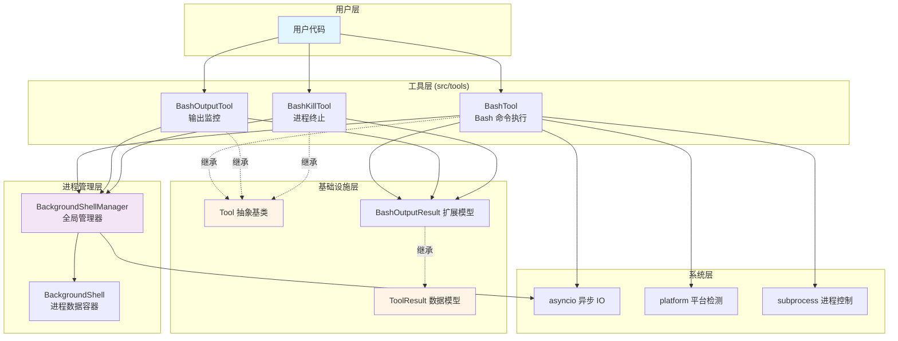
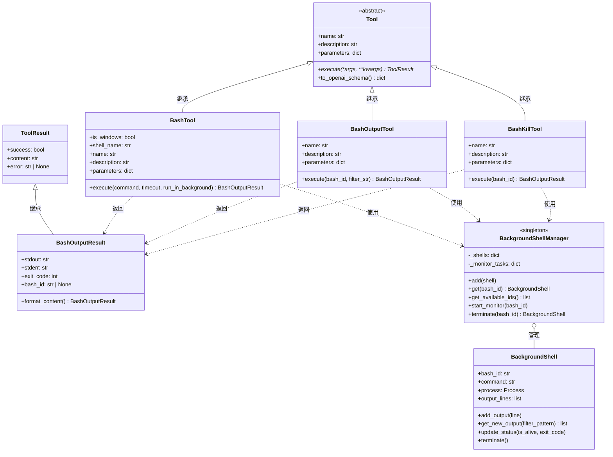
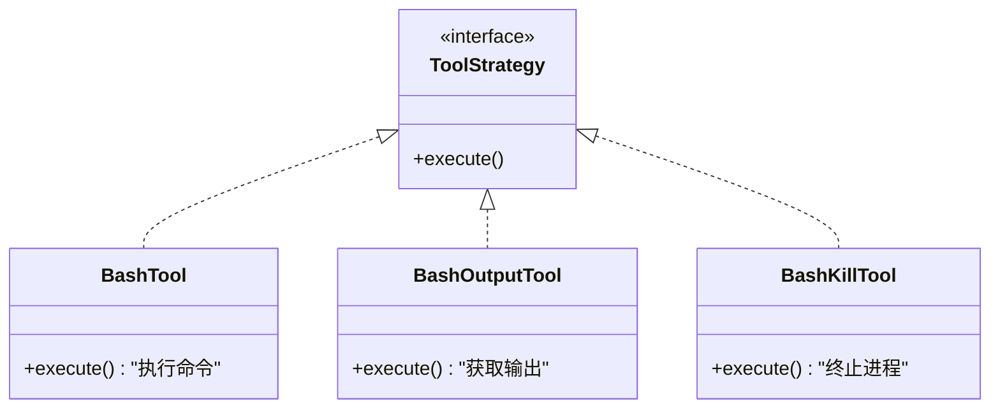
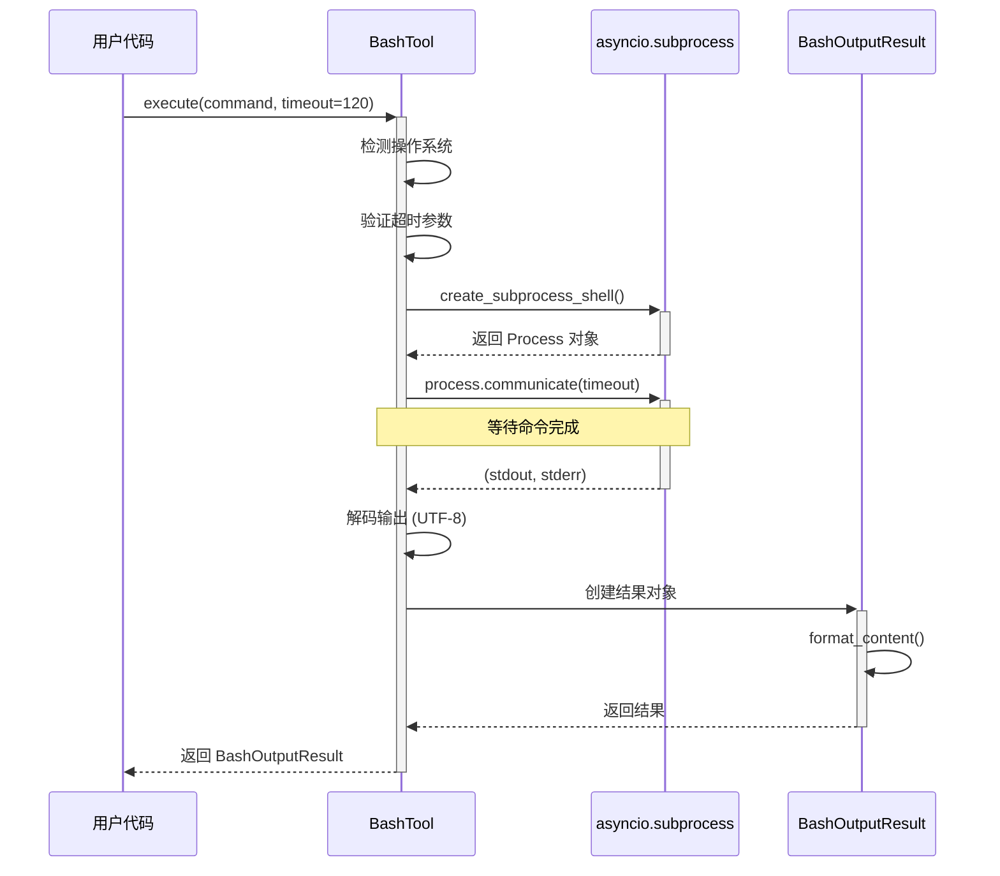
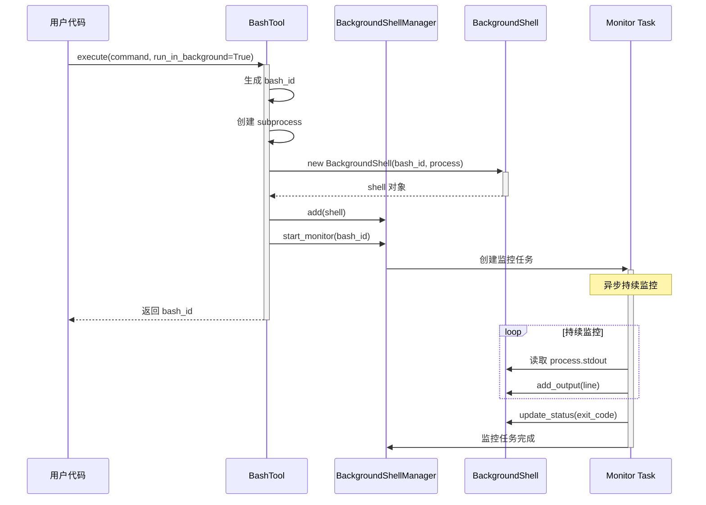
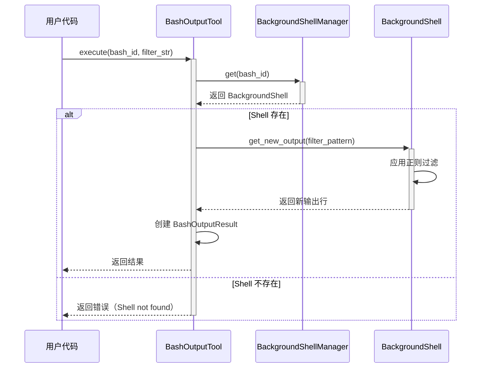
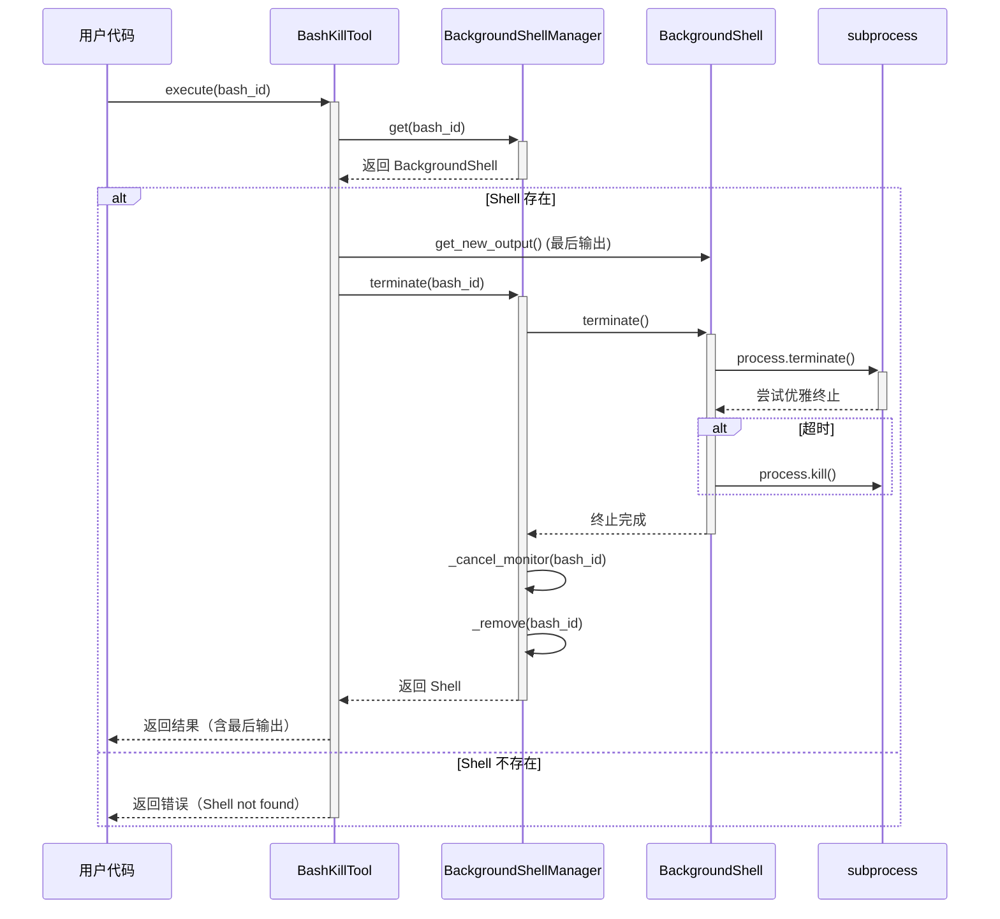
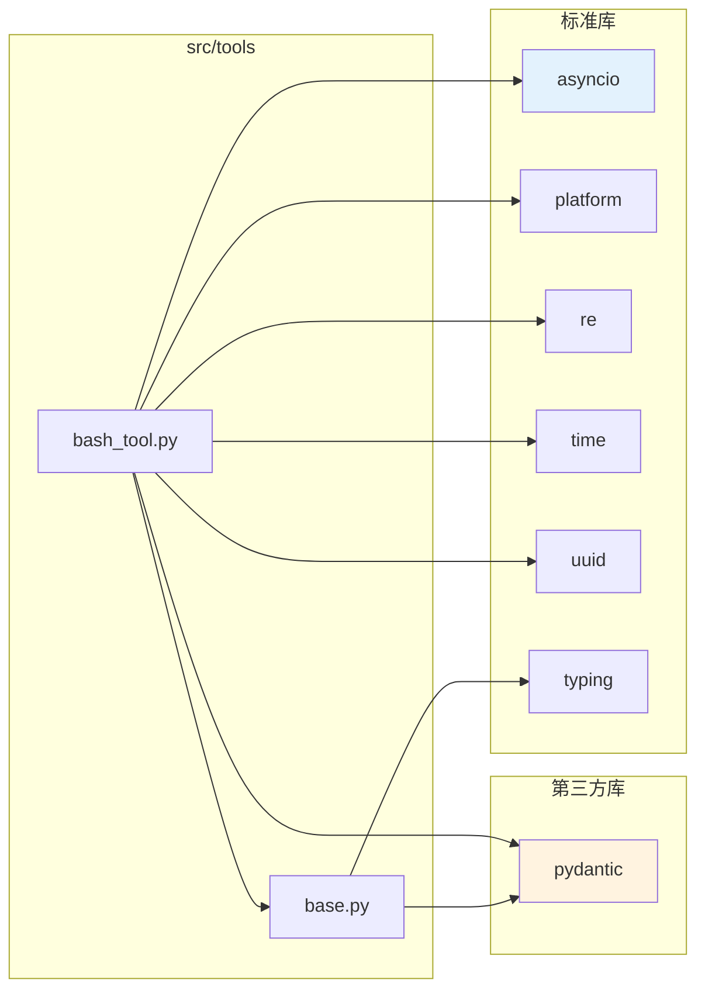

# 架构设计文档

本文档详细介绍 Tools 模块的架构设计、设计模式、核心组件和实现细节。

## 📋 目录

- [模块架构](#模块架构)
- [类层次结构](#类层次结构)
- [核心组件](#核心组件)
- [设计模式](#设计模式)
- [执行流程](#执行流程)
- [依赖关系](#依赖关系)
- [设计原则](#设计原则)

---

## 模块架构

### 整体架构图



### 模块结构

```
src/tools/
│
├── base.py                      # 基础设施层
│   ├── Tool                     # 工具抽象基类
│   │   ├── name (property)      # 工具名称
│   │   ├── description (property) # 工具描述
│   │   ├── parameters (property)  # 参数模式
│   │   ├── execute()            # 异步执行方法
│   │   └── to_openai_schema()   # OpenAI 格式转换
│   │
│   └── ToolResult               # 结果数据模型
│       ├── success: bool        # 执行状态
│       ├── content: str         # 格式化内容
│       └── error: str | None    # 错误信息
│
└── bash_tool.py                 # Bash 工具实现
    │
    ├── BashOutputResult         # 扩展结果模型
    │   ├── stdout: str          # 标准输出
    │   ├── stderr: str          # 标准错误
    │   ├── exit_code: int       # 退出码
    │   ├── bash_id: str | None  # 后台进程 ID
    │   └── format_content()     # 自动格式化
    │
    ├── BackgroundShell          # 进程数据容器
    │   ├── bash_id              # 唯一标识
    │   ├── command              # 执行命令
    │   ├── process              # 进程对象
    │   ├── output_lines         # 输出缓冲
    │   ├── add_output()         # 添加输出
    │   ├── get_new_output()     # 获取新输出
    │   ├── update_status()      # 更新状态
    │   └── terminate()          # 终止进程
    │
    ├── BackgroundShellManager   # 全局管理器（单例）
    │   ├── _shells              # 所有后台进程
    │   ├── _monitor_tasks       # 监控任务
    │   ├── add()                # 添加进程
    │   ├── get()                # 获取进程
    │   ├── get_available_ids()  # 获取所有 ID
    │   ├── start_monitor()      # 启动监控
    │   └── terminate()          # 终止并清理
    │
    ├── BashTool                 # Bash 执行工具
    │   ├── name = "bash"
    │   ├── is_windows           # 平台标识
    │   └── execute()            # 前台/后台执行
    │
    ├── BashOutputTool           # 输出监控工具
    │   ├── name = "bash_output"
    │   └── execute()            # 获取输出
    │
    └── BashKillTool             # 进程终止工具
        ├── name = "bash_kill"
        └── execute()            # 终止进程
```

---

## 类层次结构

### 继承关系图



### 类职责说明

| 类名 | 类型 | 职责 |
|------|------|------|
| `Tool` | 抽象基类 | 定义所有工具的统一接口 |
| `ToolResult` | 数据模型 | 标准化工具返回结果 |
| `BashOutputResult` | 数据模型 | Bash 专用的结果模型 |
| `BashTool` | 工具实现 | 执行 Bash/PowerShell 命令 |
| `BashOutputTool` | 工具实现 | 监控后台进程输出 |
| `BashKillTool` | 工具实现 | 终止后台进程 |
| `BackgroundShell` | 数据容器 | 封装单个后台进程状态 |
| `BackgroundShellManager` | 管理器 | 统一管理所有后台进程 |

---

## 核心组件

### 1. Tool 抽象基类

**设计目的**：
- 为所有工具提供统一的接口规范
- 确保工具可以被标准化地调用
- 支持 OpenAI 工具调用格式

**关键特性**：
- 使用 `@property` 装饰器确保接口不可变
- 强制子类实现核心方法（`NotImplementedError`）
- 自动生成 OpenAI 兼容的 schema

**接口契约**：
```python
class Tool:
    @property
    def name(self) -> str:
        """工具的唯一标识符"""
        raise NotImplementedError

    @property
    def description(self) -> str:
        """工具的功能描述"""
        raise NotImplementedError

    @property
    def parameters(self) -> dict[str, Any]:
        """JSON Schema 格式的参数定义"""
        raise NotImplementedError

    async def execute(self, *args, **kwargs) -> ToolResult:
        """异步执行工具的核心逻辑"""
        raise NotImplementedError
```

### 2. BackgroundShellManager（管理器模式）

**设计目的**：
- 集中管理所有后台进程的生命周期
- 提供统一的进程查询和控制接口
- 自动处理进程监控和资源清理

**架构特点**：
- **单例模式**：使用类方法而非实例方法
- **全局状态**：类变量存储所有进程
- **异步监控**：每个进程一个独立的监控任务

**关键机制**：

1. **进程注册**
   ```python
   BackgroundShellManager.add(shell)
   ```

2. **输出监控**
   ```python
   async def monitor():
       # 持续读取进程输出
       while process.returncode is None:
           line = await process.stdout.readline()
           shell.add_output(line)
       # 更新进程状态
       shell.update_status(is_alive=False, exit_code=returncode)
   ```

3. **资源清理**
   ```python
   await shell.terminate()        # 终止进程
   manager._cancel_monitor()      # 取消监控任务
   manager._remove(bash_id)       # 移除记录
   ```

### 3. BashOutputResult（数据验证）

**设计目的**：
- 扩展 `ToolResult`，添加 Bash 专用字段
- 自动格式化输出内容
- 提供强类型数据验证（Pydantic）

**自动格式化机制**：
```python
@model_validator(mode="after")
def format_content(self) -> "BashOutputResult":
    """从 stdout 和 stderr 自动生成 content"""
    output = ""
    if self.stdout:
        output += self.stdout
    if self.stderr:
        output += f"\n[stderr]\n{self.stderr}"
    if self.exit_code:
        output += f"\n[exit_code]: {self.exit_code}"

    self.content = output or "(no output)"
    return self
```

---

## 设计模式

### 1. 策略模式（Strategy Pattern）

**应用场景**：不同工具实现不同的执行策略



**优势**：
- 每个工具独立实现自己的逻辑
- 易于添加新工具类型
- 符合开闭原则

### 2. 管理器模式（Manager Pattern）

**应用场景**：`BackgroundShellManager` 统一管理后台进程

**结构**：
```
BackgroundShellManager (管理器)
    ├── _shells: dict (进程集合)
    ├── _monitor_tasks: dict (监控任务)
    └── 管理方法: add, get, terminate, etc.
```

**优势**：
- 集中式管理，避免资源泄漏
- 统一的访问接口
- 自动清理和垃圾回收

### 3. 模板方法模式（Template Method）

**应用场景**：`Tool.to_openai_schema()` 提供统一的格式转换

```python
def to_openai_schema(self) -> dict[str, Any]:
    """模板方法：固定的转换流程"""
    return {
        "type": "function",
        "function": {
            "name": self.name,          # 子类提供
            "description": self.description,  # 子类提供
            "parameters": self.parameters,    # 子类提供
        },
    }
```

### 4. 工厂模式（Factory Pattern）

**应用场景**：跨平台 shell 创建

```python
def __init__(self):
    self.is_windows = platform.system() == "Windows"
    self.shell_name = "PowerShell" if self.is_windows else "bash"

async def execute(...):
    if self.is_windows:
        shell_cmd = ["powershell.exe", "-NoProfile", "-Command", command]
    else:
        shell_cmd = command
    # 创建对应的进程
```

---

## 执行流程

### 前台命令执行流程



### 后台命令执行流程



### 后台输出监控流程



### 后台进程终止流程



---

## 依赖关系

### 模块依赖图



### 依赖说明

| 依赖 | 用途 | 版本要求 |
|------|------|----------|
| `asyncio` | 异步 I/O 和进程管理 | Python 3.8+ 标准库 |
| `platform` | 操作系统检测 | Python 标准库 |
| `re` | 正则表达式过滤 | Python 标准库 |
| `time` | 时间戳记录 | Python 标准库 |
| `uuid` | 生成唯一 ID | Python 标准库 |
| `typing` | 类型注解 | Python 标准库 |
| `pydantic` | 数据验证和模型 | 需要安装 |

---

## 设计原则

### SOLID 原则应用

#### 1. **单一职责原则（SRP）**

每个类只负责一件事：
- `BashTool`：只负责执行命令
- `BashOutputTool`：只负责获取输出
- `BashKillTool`：只负责终止进程
- `BackgroundShellManager`：只负责管理进程

#### 2. **开闭原则（OCP）**

对扩展开放，对修改封闭：
- 添加新工具只需继承 `Tool` 基类
- 无需修改现有代码

```python
# 扩展新工具
class MyCustomTool(Tool):
    @property
    def name(self) -> str:
        return "my_custom_tool"

    async def execute(self, **kwargs) -> ToolResult:
        # 实现自定义逻辑
        pass
```

#### 3. **里氏替换原则（LSP）**

子类可以替换父类：
- 所有工具都可以通过 `Tool` 接口调用
- `BashOutputResult` 可以替换 `ToolResult`

#### 4. **接口隔离原则（ISP）**

每个工具有自己的参数接口：
- `BashTool.parameters`：command, timeout, run_in_background
- `BashOutputTool.parameters`：bash_id, filter_str
- `BashKillTool.parameters`：bash_id

#### 5. **依赖倒置原则（DIP）**

依赖抽象而非具体实现：
- 用户代码依赖 `Tool` 抽象
- 工具实现依赖 `ToolResult` 抽象

### 其他设计原则

#### **DRY（Don't Repeat Yourself）**

- 使用 `Tool` 基类避免重复代码
- `BashOutputResult.format_content()` 自动格式化，避免手动拼接

#### **关注点分离（Separation of Concerns）**

- 工具层：负责业务逻辑
- 管理层：负责进程管理
- 数据层：负责数据验证

#### **组合优于继承（Composition over Inheritance）**

- `BackgroundShellManager` 使用组合管理多个 `BackgroundShell`
- 避免深层继承树

---

## 扩展性

### 如何添加新工具

1. **继承 `Tool` 基类**
2. **实现必需的属性和方法**
3. **使用或扩展 `ToolResult`**

示例：
```python
class CustomTool(Tool):
    @property
    def name(self) -> str:
        return "custom_tool"

    @property
    def description(self) -> str:
        return "My custom tool description"

    @property
    def parameters(self) -> dict[str, Any]:
        return {
            "type": "object",
            "properties": {
                "param1": {"type": "string"},
            },
            "required": ["param1"],
        }

    async def execute(self, param1: str) -> ToolResult:
        # 实现逻辑
        return ToolResult(success=True, content="Done")
```

### 扩展点

1. **新工具类型**：继承 `Tool`
2. **新结果模型**：继承 `ToolResult`
3. **新管理器**：参考 `BackgroundShellManager` 模式

---

## 总结

Tools 模块的架构设计具有以下特点：

✅ **清晰的分层架构**：基础设施、工具、管理、系统层分离
✅ **强类型和数据验证**：使用 Pydantic 确保类型安全
✅ **异步优先**：全面使用 asyncio 实现高性能
✅ **易于扩展**：符合 SOLID 原则，便于添加新工具
✅ **跨平台支持**：自动适配不同操作系统
✅ **完善的生命周期管理**：后台进程的完整管理机制

---

**上一篇：** [快速入门](./快速入门.md)
**下一篇：** [API 参考](./API参考.md)
